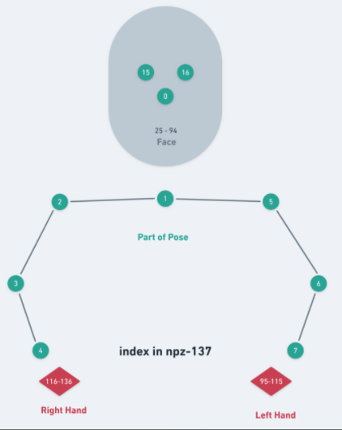

# Pose2Img
Upper body image synthesis from skeleton(Keypoints).
Pose2Img module in the ICCV-2021 paper "Speech Drives Templates: Co-Speech Gesture Synthesis with Learned Templates".
[[arxiv](https://arxiv.org/abs/2108.08020) / [github](https://github.com/ShenhanQian/SpeechDrivesTemplates)]

This is a modified implementation of [Synthesizing Images of Humans in Unseen Poses](https://openaccess.thecvf.com/content_cvpr_2018/CameraReady/1978.pdf). 


## Setup

To install dependencies, run

``` bash
pip install -r requirements.txt
```

To run this module, you need two NVIDIA gpus with at least 11 GB respectively.
Our code is tested on Ubuntu 18.04LTS with Python3.6.

## Demo Dataset and Checkpoint

- We provide the dataset and pretrained models of **Oliver** at 
  [here](https://shanghaitecheducn-my.sharepoint.com/:f:/g/personal/zhiyh_shanghaitech_edu_cn/EhttJC7dVrFApeBu1f_RVv8BdX0eYxxx1wghyThCxgDv1A?e=UPasDc). 
- According to `$ROOT/configs/yaml/Oliver.yaml`:

1. Unzip and put the data to `$ROOT/data/Oliver`
2. Put the pretrained model to `$ROOT/ckpt/Oliver/ckpt_final.pth`


## Train on the Demo dataset
1. Train Script:
``` bash
python main.py \
    --name Oliver \
    --config_path configs/yaml/Oliver.yaml \
    --batch_size 1 \
```
2. Run Tensorboard for training visualization.
``` bash
tensorboard --logdir ./log --port={$Port} --bind_all
```


## Demo

Generate a realistic video for **Oliver** from {keypoints}.npz. 

``` bash
python inference.py \
   --cfg_path cfg/yaml/Oliver.yaml \
   --name demo \
   --npz_path target_pose/Oliver/varying_tmplt.npz \
   --wav_path target_pose/Oliver/varying_tmplt.mp4
```

- In the result directory, you can find `jpg` files which correspond to the npz.

## Train on the custom dataset
- For your own dataset, you need to modify custom config.yaml.

- Prepare the keypoints using OpenPose.

- The raw keypoints for each frame is of shape (3, 137)
  which is composed of ```[pose(3,25), face(3,70), left_hand(3,21),right_hand(3,21)]```

  The definition is as follows:

  

## Citation
If you find this code useful for your research, please use the following BibTeX entry.
```
@inproceedings{qian2021speech,
  title={Speech Drives Templates: Co-Speech Gesture Synthesis with Learned Templates},
  author={Qian, Shenhan and Tu, Zhi and Zhi, YiHao and Liu, Wen and Gao, Shenghua},
  journal={International Conference on Computer Vision (ICCV)},
  year={2021}
}
```

